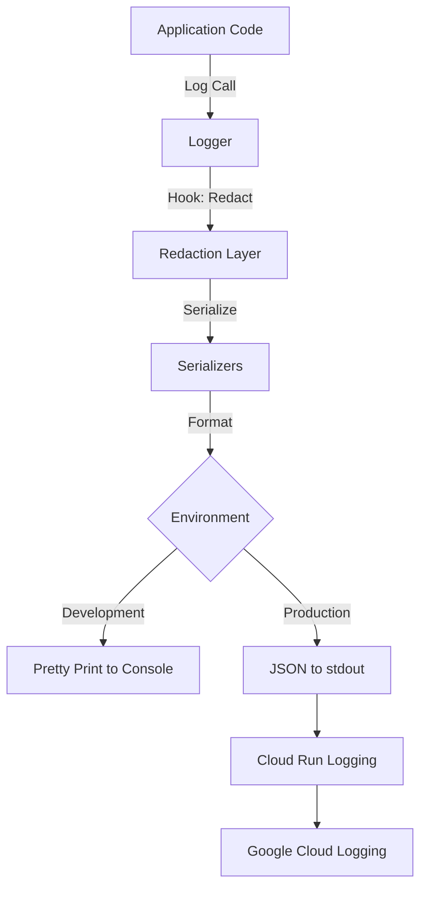

# Logging Documentation

## Overview

The authentication service uses **Pino** for structured, high-performance logging with automatic redaction of sensitive data. Logs are optimized for Cloud Run deployment and local development workflows.

## Logging Architecture



## Configuration

Logging is configured via environment variables in `.env`:

```bash
# Log level: trace, debug, info, warn, error, fatal
LOG_LEVEL=info

# Pretty printing (true for development, false for production)
LOG_PRETTY=true
```

### Log Levels

| Level | Numeric Value | Use Case |
|-------|--------------|----------|
| `trace` | 10 | Very detailed debugging information |
| `debug` | 20 | Debugging information, query logs |
| `info` | 30 | General informational messages (default) |
| `warn` | 40 | Warning messages, non-critical issues |
| `error` | 50 | Error messages, handled exceptions |
| `fatal` | 60 | Fatal errors, application crashes |

## Sensitive Data Redaction

The logger automatically redacts sensitive information to prevent credential leakage.

### Redacted Fields

The following field names (case-insensitive) are automatically redacted:

- `password`
- `token` (all variations: `access_token`, `refreshToken`, etc.)
- `githubAccessToken`, `github_access_token`
- `githubRefreshToken`, `github_refresh_token`
- `secret`
- `apiKey`, `api_key`
- `authorization`
- `cookie`
- `sessionId`, `session_id`
- `ssn`
- `creditCard`, `credit_card`
- `cvv`

### Redaction Examples

```typescript
import logger from './utils/logger';

// This log
logger.info({
  user: {
    id: 123,
    username: 'john',
    githubAccessToken: 'ghp_abc123xyz',
  },
});

// Becomes
{
  "level": "info",
  "user": {
    "id": 123,
    "username": "john",
    "githubAccessToken": "[REDACTED]"
  }
}
```

### Nested Object Redaction

Redaction works recursively through nested objects and arrays:

```typescript
logger.info({
  request: {
    headers: {
      'authorization': 'Bearer token123',
      'content-type': 'application/json',
    },
    body: {
      username: 'user',
      password: 'secret123',
    },
  },
});

// Output
{
  "level": "info",
  "request": {
    "headers": {
      "authorization": "[REDACTED]",
      "content-type": "application/json"
    },
    "body": {
      "username": "user",
      "password": "[REDACTED]"
    }
  }
}
```

## Usage Patterns

### Basic Logging

```typescript
import logger from './utils/logger';

// Simple message
logger.info('Server started');

// With context
logger.info({ port: 3000, env: 'development' }, 'Server started');

// Different levels
logger.debug('Debugging information');
logger.warn({ reason: 'timeout' }, 'Request took too long');
logger.error({ error: err }, 'Failed to process request');
```

### Child Loggers

Create child loggers for adding context to all logs:

```typescript
import { createLogger } from './utils/logger';

const requestLogger = createLogger({
  requestId: 'req-123',
  userId: 'user-456',
});

requestLogger.info('Processing request'); 
// Output includes requestId and userId in every log
```

### HTTP Request Logging

HTTP requests are automatically logged via `pino-http` middleware:

```typescript
// Configured in server.ts
app.use(pinoHttp({ logger }));
```

Log output includes:
- Request ID
- HTTP method
- URL
- Status code
- Response time
- Query parameters (redacted)
- Headers (redacted)

### Error Logging

```typescript
try {
  // Some operation
} catch (error) {
  logger.error({ err: error }, 'Operation failed');
}
```

Pino's error serializer automatically extracts:
- Error message
- Stack trace
- Error type/name

## Production Configuration

### JSON Structured Logging

In production (`NODE_ENV=production`), logs are output as JSON:

```json
{
  "level": "info",
  "time": "2024-01-15T10:30:00.000Z",
  "env": "production",
  "service": "af-auth",
  "revision": "af-auth-00001-abc",
  "msg": "Server started successfully",
  "port": 3000,
  "host": "0.0.0.0"
}
```

### Cloud Run Integration

The logger automatically includes Cloud Run metadata when available:

- `service`: From `K_SERVICE` environment variable
- `revision`: From `K_REVISION` environment variable
- `configuration`: From `K_CONFIGURATION` environment variable

This metadata enables:
- Service filtering in Google Cloud Logging
- Revision-specific log queries
- Deployment correlation

### Log Aggregation

Cloud Run automatically forwards stdout/stderr to Google Cloud Logging:

1. Logs are collected from container stdout
2. Structured JSON is parsed automatically
3. Fields are indexed for querying
4. Logs are retained per retention policy

### Querying Logs in Cloud Run

```bash
# View logs for specific service
gcloud logging read "resource.type=cloud_run_revision AND resource.labels.service_name=af-auth"

# Filter by log level
gcloud logging read "resource.type=cloud_run_revision AND severity>=ERROR"

# Filter by custom fields
gcloud logging read "jsonPayload.requestId=\"req-123\""
```

## Development Configuration

### Pretty Printing

Enable pretty printing for development:

```bash
LOG_PRETTY=true
```

Output example:
```
[10:30:00.000] INFO: Server started successfully
    port: 3000
    host: "0.0.0.0"
    env: "development"
```

### Debug Logging

Enable debug level for detailed logging:

```bash
LOG_LEVEL=debug
```

This includes:
- Database queries
- Internal state changes
- Detailed request/response data

## Best Practices

### DO's

1. **Use Structured Logging**
   ```typescript
   // Good
   logger.info({ userId, action: 'login' }, 'User logged in');
   
   // Avoid
   logger.info(`User ${userId} performed action login`);
   ```

2. **Include Context**
   ```typescript
   logger.error(
     { err: error, userId, requestId },
     'Failed to fetch user data'
   );
   ```

3. **Use Appropriate Log Levels**
   - `debug`: Detailed information for debugging
   - `info`: Normal operation events
   - `warn`: Warnings, degraded operation
   - `error`: Errors, failed operations
   - `fatal`: Critical failures requiring immediate attention

4. **Log Request IDs**
   ```typescript
   const requestLogger = createLogger({ requestId: req.id });
   requestLogger.info('Processing payment');
   ```

### DON'Ts

1. **Don't Log Sensitive Data Directly**
   ```typescript
   // Bad - bypass redaction
   logger.info(`Token: ${token}`);
   
   // Good - use structured logging with redaction
   logger.info({ token }, 'Token received');
   ```

2. **Don't Log Excessively**
   ```typescript
   // Bad - too much logging
   logger.debug('Step 1');
   logger.debug('Step 2');
   logger.debug('Step 3');
   
   // Good - log meaningful events
   logger.debug({ steps: ['1', '2', '3'] }, 'Multi-step process completed');
   ```

3. **Don't Use String Concatenation**
   ```typescript
   // Bad
   logger.info('User ' + userId + ' logged in');
   
   // Good
   logger.info({ userId }, 'User logged in');
   ```

4. **Don't Disable Redaction**
   The redaction layer is critical for security. Never bypass it.

## Performance Considerations

### Pino Performance

Pino is chosen for its performance characteristics:
- Asynchronous logging (doesn't block the event loop)
- Minimal overhead in production
- Fast JSON serialization

### Log Volume Management

1. **Use Appropriate Log Levels**: Set `LOG_LEVEL=info` in production
2. **Avoid Debug Logs in Hot Paths**: Don't log every iteration of a loop
3. **Sample High-Volume Events**: Log 1% of requests instead of all

### Log Sampling Example

```typescript
// Sample 1% of requests
if (Math.random() < 0.01) {
  logger.debug({ requestBody }, 'Request details');
}
```

## Monitoring and Alerting

### Health Check Logging

The service performs comprehensive health checks that generate structured logs for monitoring.

#### Health Check Events

**Successful Health Check:**
```json
{
  "level": "info",
  "time": "2024-12-12T10:30:00.000Z",
  "msg": "Health check completed",
  "overallStatus": "healthy",
  "duration": 15,
  "components": {
    "database": "healthy",
    "redis": "healthy",
    "encryption": "healthy",
    "githubApp": "healthy"
  }
}
```

**Failed Component:**
```json
{
  "level": "warn",
  "time": "2024-12-12T10:30:00.000Z",
  "msg": "Database health check failed",
  "env": "production"
}
```

**Readiness Check Failed:**
```json
{
  "level": "warn",
  "time": "2024-12-12T10:30:00.000Z",
  "msg": "Readiness check failed",
  "reason": "Unhealthy components: database, redis",
  "components": {
    "database": "unhealthy",
    "redis": "unhealthy",
    "encryption": "healthy"
  }
}
```

#### Querying Health Check Logs

```bash
# View all health check completions
gcloud logging read 'jsonPayload.msg="Health check completed"' \
  --limit=50 \
  --format=json

# View failed health checks
gcloud logging read 'jsonPayload.msg="Health check completed" AND jsonPayload.overallStatus!="healthy"' \
  --limit=20

# View database health failures
gcloud logging read 'jsonPayload.msg="Database health check failed"' \
  --limit=20

# View Redis health failures
gcloud logging read 'jsonPayload.msg=~"Redis.*health"' \
  --limit=20

# View readiness failures
gcloud logging read 'jsonPayload.msg="Readiness check failed"' \
  --limit=20
```

#### Health Check Metrics for Monitoring

Extract metrics from health check logs:

```bash
# Count health check failures by component in the last hour
gcloud logging read 'jsonPayload.msg="Health check completed" 
  AND timestamp>="'$(date -u -d '1 hour ago' +%Y-%m-%dT%H:%M:%SZ)'"' \
  --format=json | jq -r '.[] | .jsonPayload.components | to_entries | 
  .[] | select(.value == "unhealthy") | .key' | sort | uniq -c

# Track health status over time
gcloud logging read 'jsonPayload.msg="Health check completed"' \
  --limit=100 \
  --format=json | jq -r '[.timestamp, .jsonPayload.overallStatus] | @csv'
```

#### Setting Up Health Check Alerts

Create log-based metrics and alerts:

```bash
# Create log-based metric for unhealthy status
gcloud logging metrics create af_auth_unhealthy \
  --description="Count of unhealthy health checks" \
  --log-filter='resource.type="cloud_run_revision"
    AND jsonPayload.msg="Health check completed"
    AND jsonPayload.overallStatus="unhealthy"'

# Create log-based metric for degraded status
gcloud logging metrics create af_auth_degraded \
  --description="Count of degraded health checks" \
  --log-filter='resource.type="cloud_run_revision"
    AND jsonPayload.msg="Health check completed"
    AND jsonPayload.overallStatus="degraded"'

# Create alert policy for persistent unhealthy state
gcloud alpha monitoring policies create \
  --notification-channels=CHANNEL_ID \
  --display-name="AF Auth - Persistent Unhealthy State" \
  --condition-display-name="Unhealthy for 3 minutes" \
  --condition-threshold-value=3 \
  --condition-threshold-duration=180s \
  --condition-threshold-filter='metric.type="logging.googleapis.com/user/af_auth_unhealthy"'

# Create alert for database failures
gcloud logging metrics create af_auth_db_failures \
  --description="Database health check failures" \
  --log-filter='resource.type="cloud_run_revision"
    AND jsonPayload.msg="Database health check failed"'

# Create alert for Redis failures  
gcloud logging metrics create af_auth_redis_failures \
  --description="Redis health check failures" \
  --log-filter='resource.type="cloud_run_revision"
    AND (jsonPayload.msg="Redis is not connected" OR jsonPayload.msg="Redis health check error")'
```

#### Component-Specific Health Logging

**Database Health Check:**
```json
{
  "level": "warn",
  "msg": "Database health check failed",
  // OR
  "msg": "Database SSL is not enabled in production",
  // OR
  "level": "error",
  "msg": "Database health check error",
  "error": "Connection timeout"
}
```

**Redis Health Check:**
```json
{
  "level": "warn",
  "msg": "Redis is not connected",
  "status": "disconnected"
  // OR
  "msg": "Redis PING failed",
  "result": "ERROR"
}
```

**Encryption Health Check:**
```json
{
  "level": "error",
  "msg": "GitHub token encryption key is not configured"
  // OR
  "msg": "GitHub token encryption key is too short"
  // OR
  "msg": "JWT keys are not configured"
}
```

**GitHub App Health Check:**
```json
{
  "level": "error",
  "msg": "GitHub App configuration is incomplete"
  // OR
  "msg": "Failed to sign test JWT with GitHub App private key",
  "error": "Invalid key format"
}
```

**Cache Operations:**
```json
{
  "level": "debug",
  "msg": "Using cached GitHub App health check result"
  // OR
  "msg": "Cleared GitHub App health check cache"
}
```

### Key Metrics to Monitor

1. **Error Rate**: Count of error/fatal logs per minute
2. **Warning Rate**: Count of warning logs (may indicate degraded service)
3. **Log Volume**: Sudden increases may indicate issues
4. **Specific Events**: Failed authentication, database errors, etc.

### Setting Up Alerts in Google Cloud

```bash
# Create alert for error spike
gcloud alpha monitoring policies create \
  --notification-channels=CHANNEL_ID \
  --display-name="High Error Rate" \
  --condition-display-name="Error logs > 10/min" \
  --condition-threshold-value=10 \
  --condition-threshold-duration=60s \
  --aggregation-alignment-period=60s
```

## Troubleshooting

### Logs Not Appearing

1. Check `LOG_LEVEL` is set appropriately
2. Verify stdout isn't being buffered
3. Ensure logger is imported correctly
4. Check Cloud Run logs collection is enabled

### Sensitive Data in Logs

If sensitive data appears in logs:

1. Add the field name to `SENSITIVE_FIELDS` in `src/utils/logger.ts`
2. Redeploy the service
3. Report to security team if in production

### Performance Issues

If logging impacts performance:

1. Increase `LOG_LEVEL` to `info` or `warn`
2. Remove debug logs from hot code paths
3. Implement log sampling
4. Consider async log shipping

## Testing Logging

### Unit Tests

```typescript
import logger from './utils/logger';

// Mock logger for testing
jest.mock('./utils/logger', () => ({
  info: jest.fn(),
  error: jest.fn(),
  // ... other methods
}));

it('should log user creation', () => {
  createUser({ username: 'test' });
  
  expect(logger.info).toHaveBeenCalledWith(
    expect.objectContaining({ username: 'test' }),
    'User created'
  );
});
```

### Integration Tests

Verify redaction works correctly:

```typescript
import { redactSensitiveData } from './utils/logger';

it('should redact tokens', () => {
  const input = { githubAccessToken: 'secret' };
  const output = redactSensitiveData(input);
  
  expect(output.githubAccessToken).toBe('[REDACTED]');
});
```

## References

- [Pino Documentation](https://getpino.io/)
- [Google Cloud Logging](https://cloud.google.com/logging/docs)
- [Cloud Run Logging](https://cloud.google.com/run/docs/logging)
- [Structured Logging Best Practices](https://cloud.google.com/logging/docs/structured-logging)
